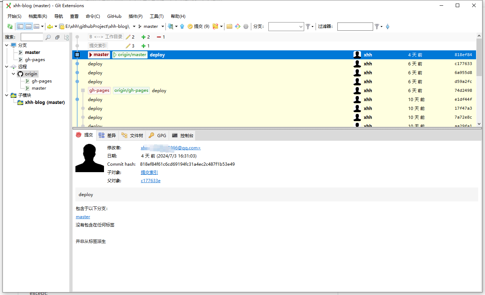
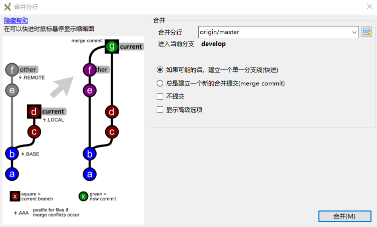

# git客户端工具

## [Git Extensions](https://gitextensions.github.io/)

---

### 分支合并

把master合并到develop分支(旧版)

把master合并到develop分支(新版)

## [SourceTreee](https://www.sourcetreeapp.com/)

### Sourcetree 是一款免费的 Git 图形界面客户端工具，适用于 Windows 和 Mac 操作系统。它简化了与 Git 仓库的交互，让开发者可以更轻松地进行版本控制和协作。

## [TortoiseGit](https://tortoisegit.org/download/)

### TortoiseGit 是一款免费的 Windows 平台上的 Git 客户端工具，它集成在 Windows 资源管理器中，提供了直观且易于使用的界面，方便开发者进行 Git 版本控制操作。

鼠标右击 -> TortoiseGit