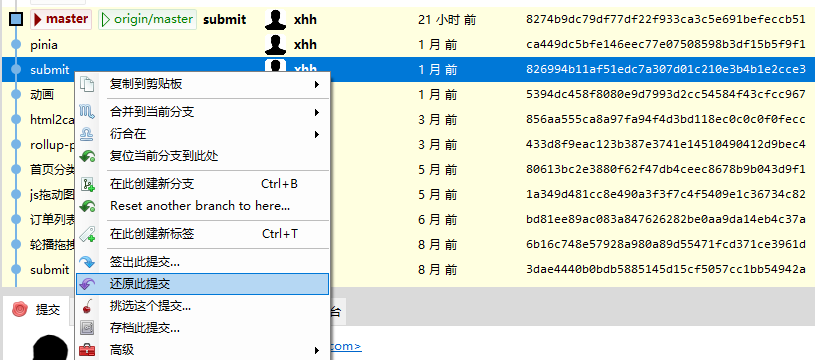
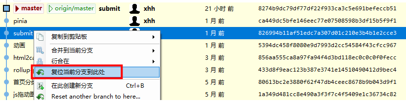

# [Git](https://git-scm.com/downloads) 

## git 简介

分布式版本控制系统，每个开发者都可以在本地完整地复制整个代码仓库，独立进行开发和版本控制。

## git常用命令

### 克隆代码库
git clone git@gitee.com:org-xhh/viteproject.git

### 创建.git文件夹，存储仓库相关信息
git init

### 本地项目关联远程仓库
git remote add origin [仓库地址]

### 查看当前配置的远程仓库
git remote -v

### 拉取远程master分支代码并合并到本地分支
git pull origin master

### 拉取代码
git pull

### 推送代码
git push

### 基于当前分支新建分支并切换至该分支
git checkout -b xhh-code

### 添加当前目录的所有文件到暂存区
git add .

### 提交暂存区到仓库区
git commit -m [message]

### 切换到指定分支，并更新工作区
git checkout develop

### 合并xhh-code分支到develop
git checkout develop

git merge xhh-code

### 暂存当前的修改
git stash

### 恢复最近一次暂存的修改，并从暂存列表中删除
git stash pop

### 撤销某个更改
git revert [commit-hash]

git push



### 回到之前的某个版本
不保留工作区的修改:
git reset --hard [commit-hash]

保留工作区的修改:
git reset --soft [commit-hash]

git push origin <分支名> --force



### 忽略文件大小写
git config core.ignorecase true(false)

### 删除文件
git rm -r --cached [file]

### commit之后撤销
git reset --soft HEAD^

### 检查当前 git 全局设置
git config --global -l

### 在master分支创建tag
git tag v1.1.0

git push origin v1.1.0

### 查看所有 tag
git tag

### 切换到某个tag
git checkout tags/v1.0.0

或

git checkout v1.0.0

### 启用 Git 长路径支持

文件层级深：Filename too long fatal: Unable to process path vendor/a/b/c...，拉取及提交代码均有报错。

全局生效
```
git config --system core.longpaths true
```

仅配置当前仓库
```
git config core.longpaths true 
```


---
### 参考文档

HBuilderX文档 - Git常用命令

https://hx.dcloud.net.cn/Tutorial/SourceControl/Git/README?id=git%e5%b8%b8%e7%94%a8%e5%91%bd%e4%bb%a4


