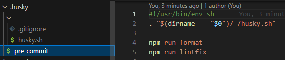

# precommit 代码提交检查

### git提交代码 precommit设置 强制代码格式化

1.安装模块(--save-dev)
```
"husky": "^1.3.1"
"lint-staged": "^12.3.4"
```


2.package.json 配置
```
"husky": {
  "hooks": {
     "pre-commit": "lint-staged"
   }
 },
 "lint-staged": {
    "src/**/*.{js,vue}": [
      "prettier --write",
      "eslint --fix"
    ]
 }
 ```


3.添加要提交的代码进暂存区，进行git commit操作，会依次执行 prettier --write和eslint --fix，代码格式如果有问题无法提交成功

如果想要越过检查，添加 --no-verify

备注：如果项目根目录自动生成.eslintcache缓存文件，想要去掉的话，查看是否有 "eslint --cache --fix" 配置，去掉--cache即可


### 如果上述方法未生效，解决方案如下：
[husky](https://typicode.github.io/husky/)

以v8为例：
```
npm pkg set scripts.prepare="husky install"
npm run prepare
npx husky add .husky/pre-commit "npm run format"
npx husky add .husky/pre-commit "npm run lintfix"
```


git commit 时，husky 会自动执行 .husky/pre-commit 文件中的脚本，如果脚本执行失败（比如 eslint 检查不通过），提交会被中断。

如果想要越过检查，可以添加 --no-verify。
