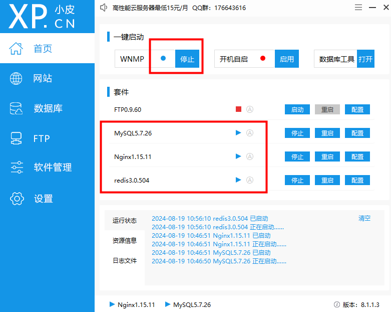
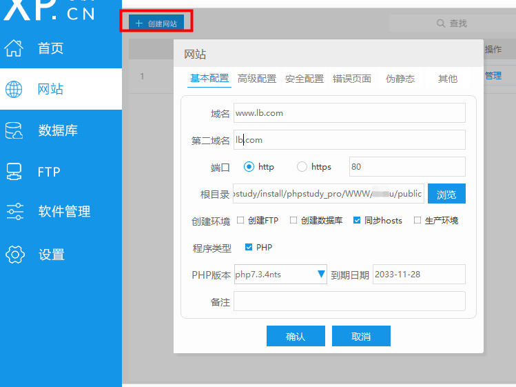
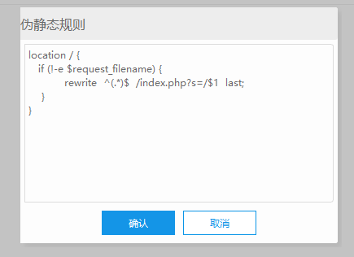
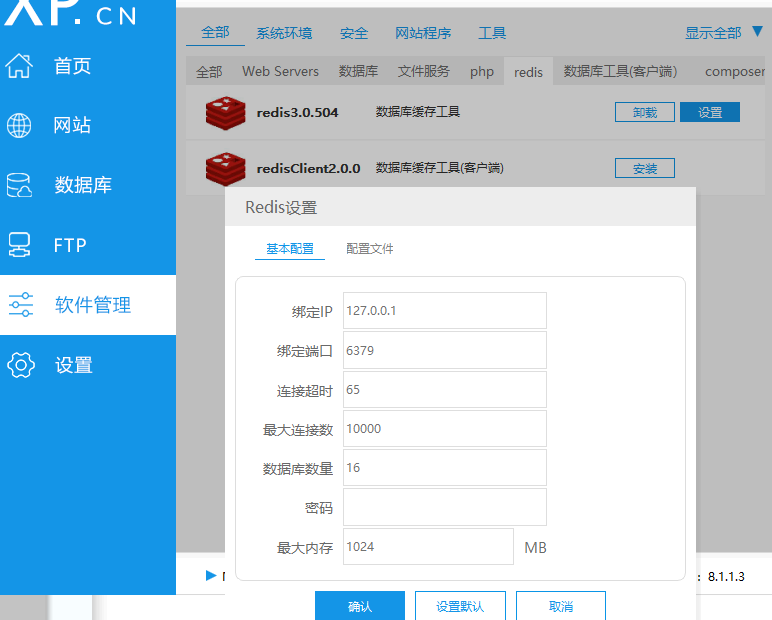

# [phpStudy](https://www.xp.cn/)

### 项目代码位置
phpstudy_pro\WWW\

### 启动服务


### 创建网站


### 网站-管理-伪静态

```
location / {
   if (!-e $request_filename) {
           rewrite  ^(.*)$  /index.php?s=/$1  last;
    }
}
```
### Redis 设置


### 打开页面
浏览器打开地址：
http://www.lb.com/mobile/help/info

（project\app\mobile\controller\Help.php 里面info方法）

模板在：project\app\mobile\view\help\info.html

### 检查项目是否缺少 .env 或 vendor 文件

### ThinkPHP 语法

https://www.kancloud.cn/manual/thinkphp5/125019
