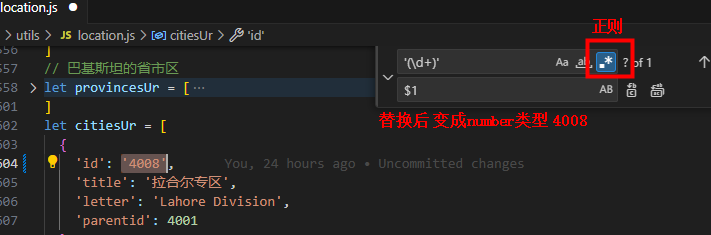
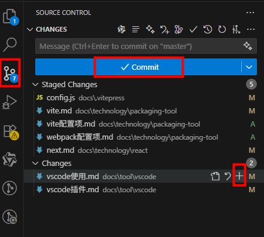
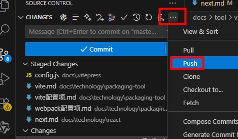
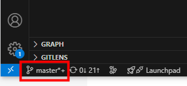
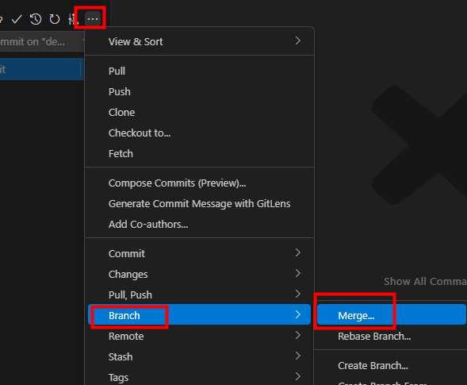

## 匹配正则

### 匹配正则表达式，将string类型替换为number类型
```
'(\d+)'
$1
```


### 正则表达式匹配源码里的中文
```
[\u4e00-\u9fa5]+
```


## Git工具

暂存、提交：


推送到远程：


左下角点击当前分支名切换分支：


切换到origin/develop分支；如要将个人分支代码合并到develop，步骤如下：

点Merge会出来分支列表，找到个人分支，即可将个人分支合到develop；然后点击push。


