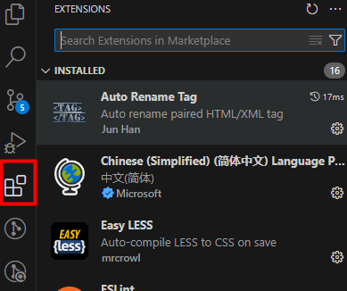
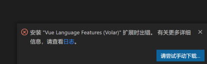
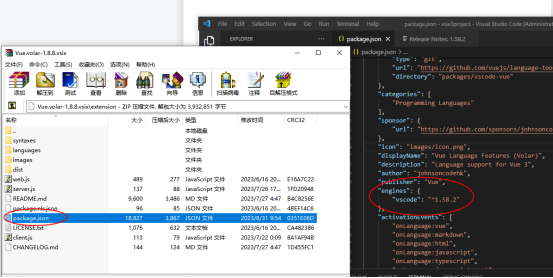
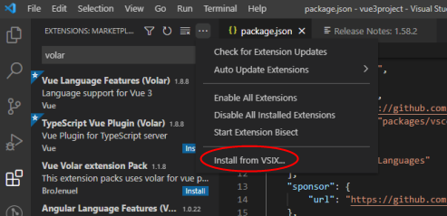
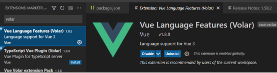
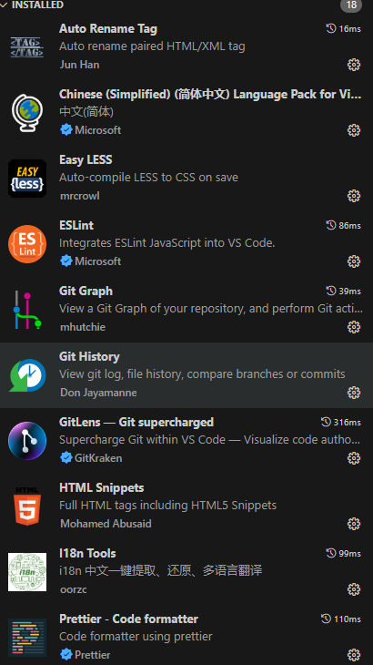
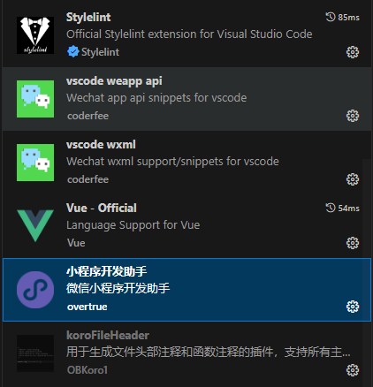

# VSCode 插件

## VSCode 插件安装

## 插件安装失败解决方案

安装Vue Language Features(Volar)时安装失败，解决方案如下：

点击手动下载(manual )，插件下载下来之后，

右击-添加到压缩文件，通过压缩文件打开.vsix文件。

打开extension文件夹，将package.json右击-复制文件到剪切板（在压缩文件中不能修改，所以要复制出去修改）

打开复制出去的package.json，找到vscode版本号，如下图：

将版本号改为自己vscode的版本号，保存后，打开压缩文件，点击左上角“添加”，覆盖压缩文件里面的package.json，
然后重新解压出来（Vue.volar-1.8.8.vsix）。

<small>vscode的版本号在 帮助→发行说明（help -> Show Release Notes）可以查看。</small>

插件 -> 更多 -> Install from VSIX:

插件就可以使用了。

## 已安装插件

