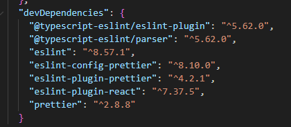

# eslint、prettier

## prettier

1. vscode 安装 Prettier 插件
2. 项目根目录新建 .prettierrc.js
```
module.exports = {
    endOfLine: "lf", // 行结束符使用 Unix 格式
    semi: false,
    singleQuote: true,
    tabWidth: 2,
    useTabs: false,
    trailingComma: "none"
}
```
3. package.json 添加 script:
```
"format": " prettier --write \"src/**/*.+(js|jsx|ts|tsx)\""
```
执行命令 npm run format 自动修复

4. 根目录.vscode/settings:
```
"editor.defaultFormatter": "esbenp.prettier-vscode",
"editor.formatOnSave": true
```

## eslint

1. vscode 安装 ESLint 插件
2. 项目安装 eslint 模块
3. 项目根目录新建 .eslintrc.js
```
module.exports = {
  env: {
    browser: true,
    es2021: true
  },
  extends: [
    'eslint:recommended',
    'plugin:react/recommended',
    'plugin:@typescript-eslint/recommended',
    'plugin:prettier/recommended'
  ],
  parser: '@typescript-eslint/parser',
  parserOptions: {
    ecmaVersion: 'latest',
    sourceType: 'module'
  },
  plugins: ['react', '@typescript-eslint'],
  rules: {}
}
```
4. package.json 添加 script:
```
"lint": "eslint --fix \"src/**/*.+(js|jsx|ts|tsx)\""
```
执行命令 npm run lint 自动修复

5. 根目录.vscode/settings:
```
{
  "eslint.format.enable": true,
  "editor.codeActionsOnSave": {
    "source.fixAll.eslint": "explicit"
  }
}
```
eslint.format.enable：开启eslint格式化功能，文件内右击选择Format Document With 即可看到eslint选项。

editor.codeActionsOnSave：代码保存时，就会通过 eslint 自动格式化代码

## eslint 和 prettier 冲突处理
1. 使用第三方包处理
```
eslint-config-prettier
eslint-plugin-prettier
prettier
```
eslint配置文件：
```
{
  extends: ['eslint:recommended', 'plugin:prettier/recommended']
}
```
这样配置，ESLint格式化时就会忽略跟Prettier冲突的格式规则，交由Prettier进行格式化。

2. 使用二者中的一个进行代码格式化

针对 js、ts、jsx 关闭(Prettier)文件保存自动格式化功能，让eslint处理
```
"[javascript]": { 
  "editor.formatOnSave": false 
}, 
"[javascriptreact]": {
  "editor.formatOnSave": false
},
"[typescript]": {
  "editor.formatOnSave": false
}
```

## 安装模块

