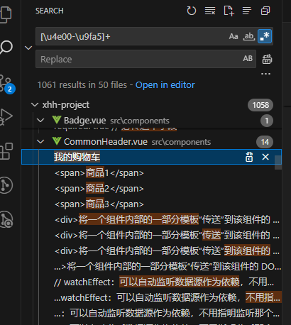

VSCode 搜索项目文件中所有的中文，导出到一个文件中


编写 LangTool.java 文件：

```
public class LangTool {
    static final String regex = "[\\u4e00-\\u9fa5]+";
    static Pattern pattern = Pattern.compile(regex);

    public static void main(String[] args) throws IOException {
        var sourceFolder = Paths.get("F:\\file\\project-name\\src\\views");
        var resultFile = Paths.get("F:\\langs.csv");

        var resultLines = new ArrayList<String>();

        Files.walk(sourceFolder, 100).forEach(p -> {
            if (!Files.isRegularFile(p)) {
                return;
            }
            var fileName = p.getFileName().toString();
            if (!fileName.endsWith(".vue") && !fileName.endsWith(".js") && !fileName.endsWith(".html")) {
                return;
            }
            Path folderName = sourceFolder.relativize(p);

            try {
                List<String> lines = null;
                try {
                    lines = Files.readAllLines(p, StandardCharsets.UTF_8);
                } catch (java.nio.charset.MalformedInputException e) {
                    lines = Files.readAllLines(p, Charset.forName("GBK"));
                }
                for (String line : lines) {
                    Matcher matcher = pattern.matcher(line);
                    while (matcher.find()) {
                        String s = line.trim();
                        if (s.startsWith("//")) {
                            continue;
                        }
                        if (s.startsWith("/*")) {
                            continue;
                        }
                        if (s.startsWith("<!--")) {
                            continue;
                        }
                        int i = line.indexOf("//");
                        if (i > 0 && i < matcher.start()) {
                            continue;
                        }

                        var langLine = String.format("\"%s\",\"%s\",\"%s\"", matcher.group(0), folderName, s);
                        resultLines.add(langLine);

                        System.out.println(langLine);
                    }
                }
            } catch (IOException e) {
                System.err.println("读取文件 " + p + " 时出错：" + e.getMessage());
                e.printStackTrace();
                throw new RuntimeException(e);
            }
        });

       Files.write(resultFile, resultLines, StandardCharsets.UTF_8);
    }
}
```

搭建 java 环境：
- 下载 sdk
- 配置环境变量 JAVA_HOME: D:\xhh-software\java\jdk-23.0.2
- 在 Path 变量中新增：%JAVA_HOME%\bin
- 验证配置，执行 java -version，输出 java version "23.0.2" ，ok

执行命令：
```
javac LangTool.java
```
生成 LangTool.class 文件；

然后再执行命令：
```
java LangTool
```
生成含有中文和所在文件目录指向的文件 langs.csv。