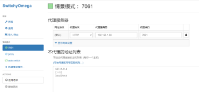
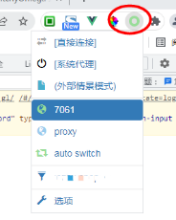
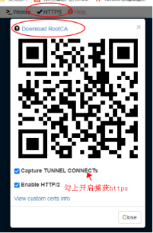
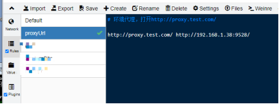
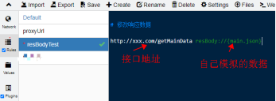
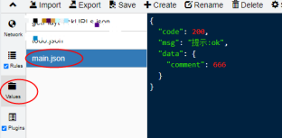

# whistle使用

## 安装whistle
npm install -g whistle


## 启动
whistle w2 start -p 7061（就可以打开：http://192.168.1.38:7061/#network） 
或 w2 start（默认 8899） 


## 配置代理
（1）浏览器代理：安装 Chrome 代理插件：推荐安装 SwitchyOmega 配置 

IP：http://192.168.1.38 

配置端口：7061 (或者默认的 8899，是上一步自己设置的端口号) 

如下图所示：
 
点击“应用选项”生效。

开启此代理服务：

（2）手机抓包配置，iOS 为例（需要先安装证书） ：

无线局域网 => 配置代理 => 手动 

  服务器：192.168.1.38 

  端口：7061 

## PC 和手机端安装根证书
打开：http://192.168.1.38:7061/#network 

依次点击：HTTPS - Download RootCA 

如下图所示：


PC端：安装在受信任的根证书

iOS 需要证书信任设置：

（1）通用 - VPN与设备管理 - 验证whistle...

（2）通用 - 关于本机 - 证书信任设置 - 信任whistle


## Rules 和 Values 使用示例
（1）环境代理，在 Rules 配置 

例如： 


（2）本地模拟接口返回值 

Rules 配置： 
```
http://xxx.com/getMainData resBody://{main.json} 
```
Values 需要添加 main.json 




## whistle 文档 
http://wproxy.org/whistle/install.html