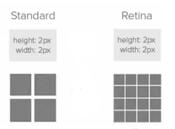
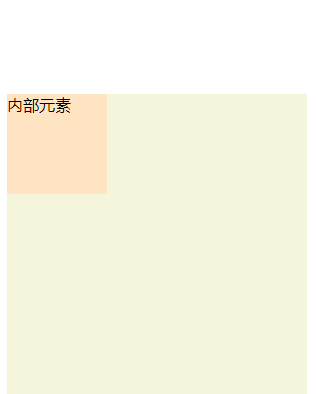
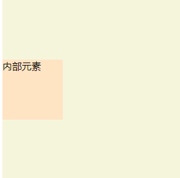

# BFC

## 什么是BFC

BFC(Block Formatting Context)，块级格式化上下文。拥有BFC属性的元素，可以看作是隔离了的独立容器，容器里边的元素不会影响到容器外边的元素。

## 形成BFC的条件

- html根元素
- float（不为none）：left、right
- position：absolute、fixed
- display：inline-block、flex、inline-flex、grid、inline-grid、flow-root
- overflow(除了 visible 以外的值):  hidden、auto、scroll

## BFC 应用场景

- 1. 解决 父元素没有高度时，子元素浮动使父级元素高度塌陷的问题
```
<div class="con1">
    
    <p>图片描述</p>
</div>

<style>
    .con1 img {
        width: 300px;
        float: left;
    }
</style>
```
.con1高度本是撑开的，img使用float之后，.con1的高度只有段落p的高度值了。

解决办法：使 .con1 成为 BFC：
```
.con1 {
    overflow: hidden;
}
```
除此之外，可以看到：


p元素占满了整个容器宽度，那如何让p元素只占除了图片之外的宽度呢？

解决方法：使 img 成为 BFC(overflow: hidden)，这样p标签就会形成一个独立的渲染区域，宽度不会延伸到img那里。

- 2. 解决 子元素外边距使父元素塌陷的问题
```
 <div class="con2">
    <div class="inner">内部元素</div>
</div>
.con2 {
    width: 300px;
    height: 300px;
    background-color: beige;
}
.con2 .inner {
    width: 100px;
    height: 100px;
    background-color: bisque;
    margin-top: 100px;
}
```


给子元素设置margin-top，结果父元素跟着塌陷。

解决方法：使 .con2 成为 BFC (overflow: hidden)


