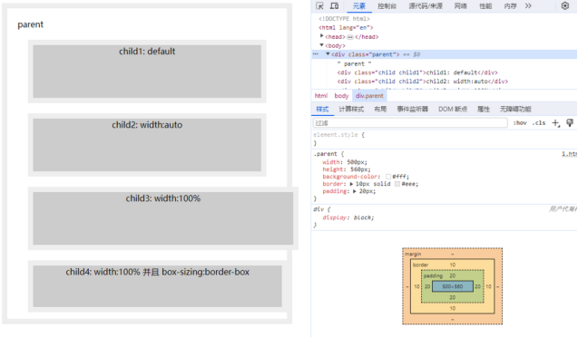
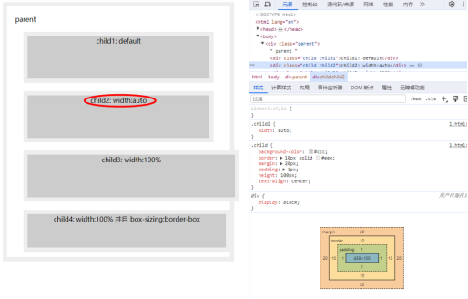
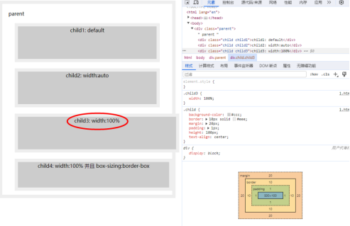
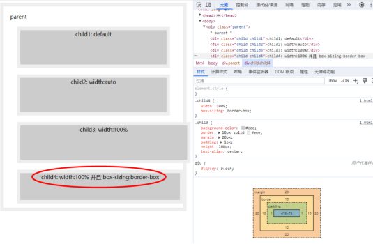

### 一、width话题引入
width属性定义元素内容区的宽度，在内容区外面可以增加内边距、边框和外边距。那分别设置 width:auto、width:100% 有什么区别呢？设置box-sizing: border-box对元素宽度有什么影响？

### 二、代码demo
```
<!DOCTYPE html>
<html lang="en">
  <head>
    <meta charset="UTF-8" />
    <meta name="viewport" content="width=device-width, initial-scale=1.0" />
    <title>css中width的小九九</title>
  </head>

  <style>
    .parent {
      width: 500px;
      height: 560px;
      background-color: #fff;
      border: 10px solid #eee;
      padding: 20px;
    }

    .child {
      background-color: #ccc;
      border: 10px solid #eee;
      margin: 20px;
      padding: 1px;
      height: 100px;
      text-align: center;
    }
    .child2 {
      width: auto;
    }
    .child3 {
      width: 100%;
    }
    .child4 {
      width: 100%;
      box-sizing: border-box;
    }
  </style>

  <body>
    <div class="parent">
      parent
      <div class="child child1">child1: default</div>
      <div class="child child2">child2: width:auto</div>
      <div class="child child3">child3: width:100%</div>
      <div class="child child4">child4: width:100% 并且 box-sizing:border-box</div>
    </div>
  </body>
</html>
```


### 三、分析
1.child1：宽度默认auto，和child2一致

2.child2：设置width:auto



最终宽度：
```
500(父元素宽度) - 20(子元素margin)∗2 - 10(子元素border)∗2 - 1(子元素padding)∗2 = 438
```
3.child3：设置width:100%


最终宽度：
```
500(父元素宽度)
```
4.child4：

设置width:100%; box-sizing: border-box;
```
box-sizing：border-box;
盒子width = 内容的宽度 + padding + border
盒子height = 内容的高度 + padding + border

box-sizing：content-box;
盒子width = 内容的宽度
盒子height = 内容的高度
```

```
最终宽度：500 - 1(子元素padding)∗2 - 10(子元素border)∗2 = 478
```

### 四、结论
* width:auto 是子元素的 content + padding + border + margin 撑满父元素的 content。
* width:100% 是子元素的 content 撑满父元素的 content。
* 在开发中尽量选择设置 width: auto，避免子元素设置 padding、border、margin等导致子元素溢出父元素。
* 在开发中可以选择在根元素设置 box-sizing:border-box