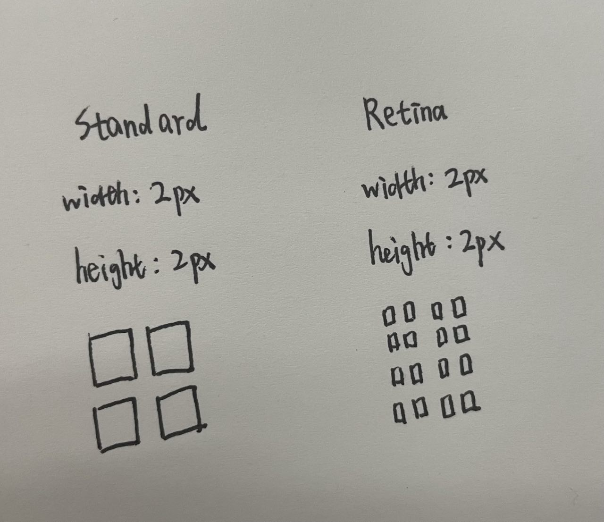

# CSS 单位 和 dpr

## CSS 单位有哪些

- px

绝对长度单位，像素（在屏幕上显示的最小单位）

- rpx 

微信小程序 和 uni-app 中使用，用于解决屏幕自适应，规定屏幕宽度为750px，则px和rpx的计算公式为：

px =（750/设备的逻辑像素）* rpx

- em

相对长度单位，基准点为父节点字体的大小，如果自身定义了font-size则按自身来计算

- rem

相对长度单位，相对于根元素的字体大小

- vh

（Viewport Height）

相对长度单位，相对于当前浏览器窗口的可视区域，1vh相当于浏览器可视区域高度的1%，100vh即100%

- vw

（Viewport Width）

相对长度单位，相对于当前浏览器窗口的可视区域，1vw相当于浏览器可视区域宽度的1%，100vw即100%

- vmin

视口宽度和高度中较小的那个百分比

例如，如果视口的宽度为1000px，高度为800px，那么1vmin就等于8px（即800px的0.1）

- vmax

视口宽度和高度中较大的那个百分比

例如，如果视口的宽度为1000px，高度为800px，那么1vmax就等于10px（即1000px的0.1）

- % 

百分比，相对于父元素

- ch

相对长度单位。一般是 1ch = 1个0 = 一个英文字母

## CSS 像素

**CSS像素**(css pixel)可称为**逻辑像素**(logical pixel)，也可以称为**设备独立像素**(dip: device independent pixel)。

设备像素也叫物理像素，设备分辨率描述的就是这个显示器的宽和高分别是多少个设备像素。

物理像素 = 逻辑像素 * dpr（dpr跟设备有关）

| 逻辑分辨率 Point     | 缩放因子                | 设备分辨率 Pixel                                                            |
| ---------- | ----------------------- | --------------------------------------------------------------- |
| 320*480        | @1x           | 320*480              |
| 320*480     | @2x          | 640*960                                      |

## 设备像素比dpr

**dpr**: device pixel ratio

dpr = 同一方向上的物理像素 / CSS像素 (缩放比是1的情况)，同一方向就是指的横向比或者纵向比。



我们以一个方向为例，比如横向

标清屏：dpr = 2 / 2 = 1

高清屏：dpr = 4 / 2 = 2

dpr = 2 表示1个css像素用 2 * 2 个设备像素来绘制

**dpr=1的就是标清屏，dpr>1的就是高清屏**

dpr越大，1 CSS像素表示的物理像素点越多，显示越清晰。

## dpr使用

- js获取
```
window.devicePixelRatio
```

-  媒体查询

在 dpr=2 的屏幕上展示两倍图 (@2x)，在 dpr=3 的屏幕上展示三倍图 (@3x)。
```
.avatar {
    background-image: url('~@/assets/image/img.png');
}
@media only screen and(-webkit-min-device-pixel-ratio:2){
    .avatar {
        background-image: url('~@/assets/image/img@2x.png');
    }
}
@media only screen and(-webkit-min-device-pixel-ratio:3){
    .avatar {
        background-image: url('~@/assets/image/img@3x.png');
    }
}
```
- srcset

img标签的srcset属性
```

```

## 12px 以下的文字大小

### 让 Chrome 支持小于 12px 的文字

chrome://settings/fonts

### zoom

zoom: 0.5, 缩小到原来的一般，要考虑兼容性问题。

### scale
```
.ele {
 font-size: 12px;
 display: inline-block;
 -webkit-transform: scale(0.8);
}
```