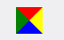

# Style

### 0.5px 全边框
```
li {
  position: relative;
  &::after {
    content: '';
    position: absolute;
    width: 200%;
    height: 200%;
    top: 0;
    left: 0;
    border: 1px solid #eee;
    border-radius: 16px;
    transform: scale(0.5, 0.5);
    transform-origin: 0 0;
    box-sizing: border-box;
  }
}
```

### 0.5px 下边框
```
li {
  position: relative;
  &::after {
    content: '';
    position: absolute;
    width: 200%;
    height: 1px;
    left: 0;
    bottom: 0;
    background-color: #eee;
    transform: scale(0.5);
    transform-origin: 0 0;
  }
}
```

### 三角形
```
.triangle {
  width: 0;
  height: 0;
  border-width: 15px;
  border-style: solid;
  border-top-color: red;
  border-left-color: green;
  border-right-color: yellow;
  border-bottom-color: blue;
}
```


补充：使用svg绘制三角形
```
<svg width="100" height="100">
  <polygon points="100,100 100,0 0,100" fill="darkolivegreen" />
</svg>
```

### 滚动条
```
/* Webkit浏览器滚动条样式 */
.common-scrollbar::-webkit-scrollbar {
  width: 8px; /* 滚动条宽度 */
}
.common-scrollbar::-webkit-scrollbar-track {
  background: #f1f1f1; /* 轨道 */
  border-radius: 4px;
}
.common-scrollbar::-webkit-scrollbar-thumb {
  background: #c1c1c1; /* 滑块 */
  border-radius: 4px;
}
.common-scrollbar::-webkit-scrollbar-thumb:hover {
  background: #a8a8a8; /* 悬停时滑块颜色 */
}
```

### 文字渐变
```
.gradient-text {
  background: linear-gradient(45deg, #ff6b6b, purple);
  background-clip: text;
  -webkit-background-clip: text; /* 背景裁剪到文字 */
  -webkit-text-fill-color: transparent; /* 文字透明 */
}
```

### 文字阴影
```
text-shadow: 2px 2px 4px rgba(0, 0, 0, 0.4);

text-shadow: 1px 1px 0 #FF3B2F, 
            2px 2px 0 purple, 
            3px 3px 5px rgba(0, 0, 0, 0.6); /* 多层阴影 */
```

### 文字溢出省略
需要固定宽度
```
.text-ellipsis {
  white-space: nowrap; 
  overflow: hidden; 
  text-overflow: ellipsis;
}

.text-ellipsis3 {
  display: -webkit-box;
  -webkit-line-clamp: 3; /* 显示3行 */
  -webkit-box-orient: vertical;
  overflow: hidden;
}
```
### 悬浮阴影动画
```
.navbar {
  background: #fff;
  border-radius: 8px;
  padding: 16px;
  transition: all 0.3s ease;
  box-shadow: 0 4px 6px -1px #00000014, 0 2px 4px -2px #0000000f;
}
.navbar:hover {
  transform: translateY(-6px) scale(1.02);
  box-shadow: 0 20px 25px -5px #00000026, 0 8px 10px -6px #0000001a;
}
```
