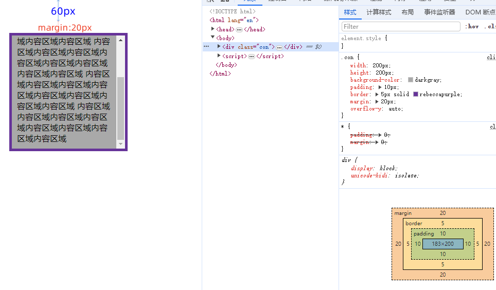

# DOM对象“各种”宽高距离属性

- clientWidth, clientHeight

- offsetWidth, offsetHeight

- scrollWidth, scrollHeight

- scrollLeft, scrollTop

- offsetTop, offsetLeft

clientHeight = height(200) + padding(10+10) = 220

offsetHeight = height(200) + padding(10+10) + border(5+5) = 230

scrollHeight = clientHeight + scrollTop

clientWidth = width(200) + padding(10+10) - 滚动条宽度(17) = 203

offsetWidth = width(200) + padding(10+10) + border(5+5) = 230

scrollWidth = clientWidth（没有水平滚动时）

offsetTop = 60 + 20 = 80

offsetLeft = 60 + 20 = 80（当前元素左上角在offsetParent节点内向左偏移的像素数）

如果当前元素的父元素没有CSS定位，offsetParent为body；
如果当前元素的父元素有CSS定位（position不是static），offsetParent取最近的父元素。

---

> offsetWidth

内容宽度 + 内边距（padding） + 边框（border） + 垂直滚动条宽度（若有）

> clientWidth

内容宽度 + 内边距（padding）

> scrollWidth

元素内容总宽度（含所有可见/不可见内容，不含滚动条、边框）

> 是否滚动到水平最右侧

scrollLeft + clientWidth >= scrollWidth

