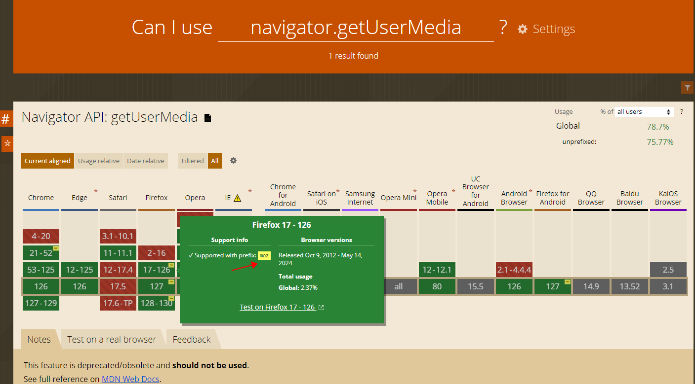

# [Can I use](https://caniuse.com/)

### 浏览器前缀

- webkit: 主要用于基于WebKit内核的浏览器，如 Chrome 和 Safari

- moz: 用于基于Gecko内核的浏览器，主要是 Firefox

- ms: 用于基于Trident内核的浏览器，主要是 Internet Explorer

- o: 用于基于Presto内核的浏览器，主要是 Opera
