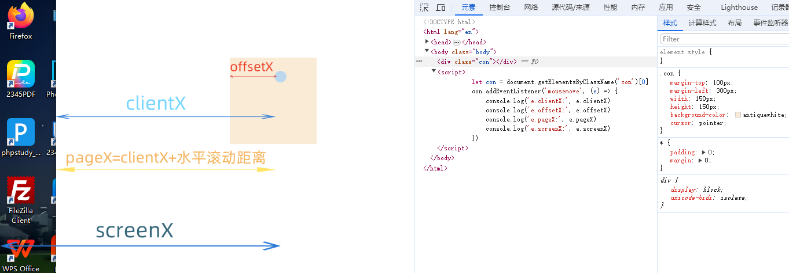

# event事件属性 

## clientX, clientY
与页面是否有滚动无关。

clientX 只读属性，它提供事件发生时的应用客户端区域的水平坐标 (与页面坐标不同)。

clientY 只读属性，它提供事件发生时的应用客户端区域的垂直坐标 (与页面坐标不同)。

## offsetX, offsetY
offsetX 只读属性，规定了事件对象与目标节点的内填充边（padding edge）在 X 轴方向上的偏移量。

offsetY 只读属性，规定了事件对象与目标节点的内填充边（padding edge）在 Y 轴方向上的偏移量。

## pageX, pageY
包括滚动值。

pageX 只读属性，返回相对于整个文档的 x（水平）坐标以像素为单位的属性。

pageY 只读属性，返回触发事件的位置相对于整个 document 的 Y 坐标值。

## screenX, screenY 
screenX 只读属性，鼠标在全局（屏幕）中的水平坐标（偏移量）。

screenY 只读属性，鼠标在全局（屏幕）中的垂直坐标（偏移量）。

