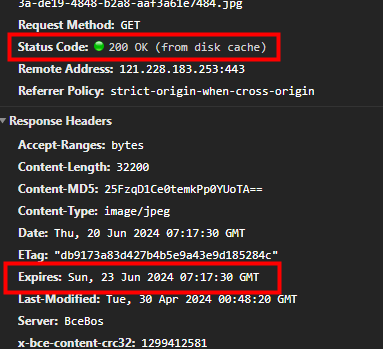
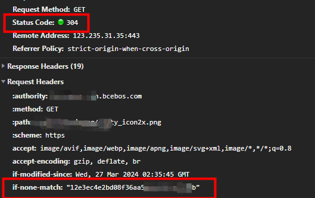

# http缓存

## http缓存的作用及存储位置

减少网络流量和延迟，减少HTTP请求的数量，提高网站性能和加载速度，降低服务器负载。

缓存的资源文件主要存储在 memory cache 和 disk cache 中

- **memory cache**: 将资源文件缓存到内存中。下次请求的时候直接从内存中读取。
- **disk cache**: 将资源文件缓存到硬盘中。下次请求的时候直接从硬盘中读取。

由浏览器决定是存储在 memory cache 还是 disk cache 中。

两者的区别:

1.memory cache(内存缓存)退出进程时数据会被清除，而disk cache(硬盘缓存)退出进程时数据不会被清除。

内存读取比硬盘中读取的速度更快。但是也不能把所有数据放在内存中缓存，因为内存也是有限的。

2.memory cache(内存缓存)一般会将脚本、字体、图片等存储到内存缓存中。

3.disk cache(硬盘缓存)一般是非脚本文件，比如css这些。

缓存读取的原理：先从内存中查找对应的缓存，如果内存中能找到就读取对应的缓存，否则就从硬盘中查找对应的缓存，如果有就读取，否则就重新发起网络请求。

根据是否需要向服务器重新发起 HTTP 请求将缓存过程分为两种，分别是强缓存和协商缓存。

## 强缓存

强缓存是通过在HTTP响应头中设置特定的字段，告知客户端在一定的有效期内直接从本地缓存中获取资源；下次请求时，浏览器会先检查本地缓存是否存在该资源，如果未过期则直接从缓存中获取资源，无需再向服务器发送请求的一种缓存机制。

常见的控制字段包括**Cache-Control**和**Expires**。

- Expires 是 HTTP/1.0 中定义的一个响应头字段，用于指定资源的到期时间

- Cache-Control（优先级高）是 HTTP/1.1 中最重要的缓存控制字段之一，只需要在响应头添加上需要缓存的时间就行了

    Cache-Control 可设置字段：
    - no-cache: 需要进行协商缓存，发送请求到服务器确认是否使用缓存。
    - no-store：禁止使用缓存，每一次都要重新请求数据。
    - public：可以被所有的用户缓存，包括终端用户和 CDN 等中间代理服务器。
    - private：只能被终端用户的浏览器缓存，不允许 CDN 等中继缓存服务器对其缓存。
    - max-age：表示缓存可以使用多长时间，是一个相对时间

### 强缓存的缺点

- 后端资源修改了，前端无法实时获取最新资源

    可以在文件名后面带上hash值，只要资源被修改，hash值就会更改，浏览器就会重新发起请求。

- 通过浏览器url地址栏发送的get请求，无法被强缓存

    但通过页面上的链接、表单提交、ajax请求等方式发送的get请求，可以被强缓存。

强缓存图片

## 协商缓存

客户端在重新获取资源时向服务器询问该资源的状态，并根据服务器返回的状态来决定是否使用缓存。

在协商缓存中，主要使用的头部字段有：

#### Last-Modified / If-Modified-Since

- 当服务器响应一个资源请求时，会在响应头中包含 Last-Modified 字段，表示资源的最后修改时间。

- 当客户端再次请求相同资源时，会在请求头中包含 If-Modified-Since 字段，值为上一次获取资源时服务器返回的 Last-Modified 时间。

- 服务器收到带有 If-Modified-Since 字段的请求后，会比较该字段的值与资源的最后修改时间，如果资源的最后修改时间大于 If-Modified-Since 字段的值，则返回资源内容和状态码 200 OK，并更新 Last-Modified 为新的值；如果资源的最后修改时间等于 If-Modified-Since 字段的值，则返回状态码 304 Not Modified，告知客户端可以使用缓存的资源。

#### ETag / If-None-Match（优先级高）

- 当服务器响应一个资源请求时，可以在响应头中包含 ETag 字段，表示资源的标识符。

- 当客户端再次请求相同资源时，可以在请求头中包含 If-None-Match 字段，值为上一次获取资源时服务器返回的 ETag。

- 服务器收到带有 If-None-Match 字段的请求后，会比较该字段的值与资源的当前 ETag，如果两者相等，则返回状态码 304 Not Modified，告知客户端可以使用缓存的资源；如果两者不相等，则返回新的资源内容和状态码 200 OK。

协商缓存图片

