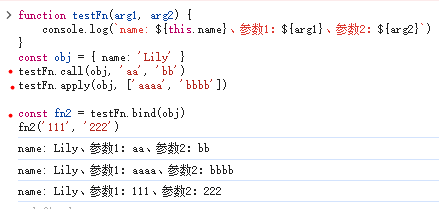

# This

## 什么是 this?
- 一个关键字，一个特殊的对象引用
- 运行时绑定，在函数被调用时确定

## 默认绑定
- 非严格模式：全局对象（window）
- 严格模式：undefined


## 隐式绑定
场景：函数作为对象的一个方法被调用

指向：调用该方法的对象本身
```
const obj = {
    name: 'Lily',
    sayHi: function() {
        console.log(`Hello, ${this.name}`)
    }
}
// this 指向 obj
obj.sayHi()   // Hello, Lily
```

## 隐式丢失
场景：将对象方法赋值给一个新变量后独立调用

结果：this指向丢失，触发了默认绑定
```
const obj = {
    name: 'Lily',
    sayHi: function() {
        console.log(`Hello, ${this.name}`)
    }
}
const hiFn = obj.sayHi
hiFn()   
```
非严格模式：Hello,  &nbsp;&nbsp;&nbsp;&nbsp;&nbsp;(this 指向全局变量)

严格模式：<font color=red>Uncaught TypeError: Cannot read properties of undefined (reading 'name')</font>

## 显示绑定
- call
    - .call(thisArg, arg1, arg2, ...)
    - 立即调用函数
    - this 指向 thisArg
    - 参数逐个传递
- apply
    - .apply(thisArg, [arg1, arg2, ...])
    - 立即调用函数
    - this 指向 thisArg
    - 参数传递一个数组
- bind
    - .bind(thisArg)
    - 不立即调用
    - 返回一个this被永久绑定的新函数
    - 也称“硬绑定”



## 手写 apply
```
Function.prototype.myApply = function(context, argsArray) {
  if (context === null || context === undefined) {
    context = globalThis // 浏览器环境是window，Node环境是global
  } else {
    // 将非对象类型转换为对象，确保可以添加属性
    context = Object(context)
  }
  
  // 生成唯一属性名，避免覆盖context原有属性
  const fnKey = Symbol('fn')
  context[fnKey] = this
  
  const args = Array.isArray(argsArray) ? argsArray : []
  
  // context[fnKey]调用context对象的fnKey函数，此时this就是context对象
  const result = context[fnKey](...args)
  
  // 避免污染原对象
  delete context[fnKey]
  
  return result
}

function greet(age, sex) {
  return `greet: ${this.name}, ${age}, ${sex}`
}
const person = { name: 'Amy' }

console.log(greet.myApply(person, ['15', '男'])) // 输出: greet: Amy, 15, 男
```


## new 绑定
场景：使用 new 关键字调用函数(构造函数)

指向：this 指向一个全新的空对象

### new 关键字做了什么？
1. 创建一个全新的空对象
2. 新对象的原型链接到构造函数的 prototype 属性
3. 新对象被绑定为函数调用的 this
4. 隐式返回 this (若函数无其他返回)
```
function Person(name) {
    // 1. this = {}
    this.name = name
    // 2. return this
}
const user = new Person('Lily')
console.log(user.name)   // Lily
```
在 Person 调用中，this 指向 user

## 箭头函数
- 箭头函数没有自己的 this
- this 绑定在创建时确定，而不是在调用时确定
- 一旦绑定，不可被 call/apply/bind 修改
```
const obj = {
    name: 'Lily',
    // 定义时，这里的 this 是全局对象
    sayHi: () => {
        console.log(`Hello, ${this.name}`)
    }
}
obj.sayHi() // Hello,  
```

## 绑定规则优先级
new > 显示 > 隐式 > 默认

### 实例
```
const myTimer = {
    count: 0,
    start() {
        setTimeout(function() {
            // 这里的 this 指向 谁？
            console.log(++this.count)
        }, 1000)
    }
}
myTimer.start()
```
setTimeout 的回调函数被独立调用，丢失了 myTimer 的上下文，触发了默认绑定，this 指向全局。

解决方式1：bind(this)
```
setTimeout(function() {
    console.log(++this.count)
}.bind(this), 1000)
```
解决方式2：箭头函数
```
setTimeout(() => {
    console.log(++this.count)
}, 1000)
```