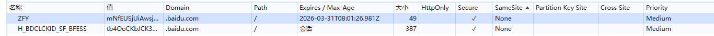

# cookie、localStorage、sessionStorage

### Cookie 属性

- Expires 和 Max-Age：Cookie的过期时间
- Domain：Cookie的作用域，默认是当前域名
- Path：只有特定目录下的页面才可以读取Cookie
- Secure：设置Secure属性，确保Cookie仅在HTTPS连接中传输
- HttpOnly：标记为HttpOnly的Cookie不能被JavaScript访问，减少XSS攻击风险
- SameSite：防止CSRF攻击，取值： Strict、Lax、None。

    SameSite有三个属性：
    - ‌Strict‌：当网址与请求域名完全一致时，Cookie才会被发送；
    - ‌Lax‌：在跨站点的情况下，只有对GET请求才会发送Cookie，而对于POST请求等非安全的HTTP方法则不会发送；
    - ‌None‌：无论是跨站点还是同站点，Cookie都会被发送。当设置SameSite=None时，必须同时设置Secure属性，以确保Cookie只能通过HTTPS发送。


### 存储方式区别

#### 存储大小
- Cookie：单个 Cookie 的大小限制在 4KB 左右；
- LocalStorage：存储容量为 5MB 左右；
- SessionStorage：一般也是 5MB 左右；

#### 数据有效期
- Cookie：如果设置了过期时间，Cookie 会在指定时间后自动删除；如果没有设置过期时间，关闭浏览器就会被清空；
- LocalStorage：数据会一直存储在浏览器中，除非手动清除；
- SessionStorage：数据仅在当前会话期间有效，如果用户关闭当前标签页，SessionStorage 中的数据会被清除；

    通过 window.open 新建标签页后可以在新建会话时复制上一个会话，之后两个 sessionStorage 相互独立。

#### 数据传输
- Cookie：网址和接口域名同源时，异步请求头里会自动携带 Cookie；服务器也可以修改 Cookie 并将其返回给客户端；

    跨域请求时，异步请求(axios)需要设置 withCredentials: true
- LocalStorage：数据仅存储在客户端，不会随 HTTP 请求发送到服务器；
- SessionStorage：数据只存储在客户端，不会在请求中传输；

#### 访问权限
- Cookie：可以通过 JavaScript 的 document.cookie 属性进行读写操作；

JS设置Cookie：
```
const cookieExpirationHours = 7 * 24 // 7天后过期
const expiresIn = new Date(Date.now() + cookieExpirationHours * 60 * 60 * 1000)
document.cookie = "username=cookieName; expires=" + expiresIn + "; path=/; Secure; HttpOnly; SameSite=Strict"
```

- LocalStorage：通过 JavaScript 的 localStorage 对象访问，不同域名下的 LocalStorage 是相互隔离的；
- SessionStorage：通过 JavaScript 的 sessionStorage 对象访问，同样遵循同源策略；

#### 应用场景
- Cookie：常用于存储用户的登录信息、用户偏好设置等；
- LocalStorage：适合存储一些不经常变化的数据，由于其数据持久性，用户下次访问页面时可以快速恢复之前的状态；
- SessionStorage：适用于临时保存同一窗口（或标签页）的数据，在关闭窗口（或标签页）后数据不需要保留的场景；
