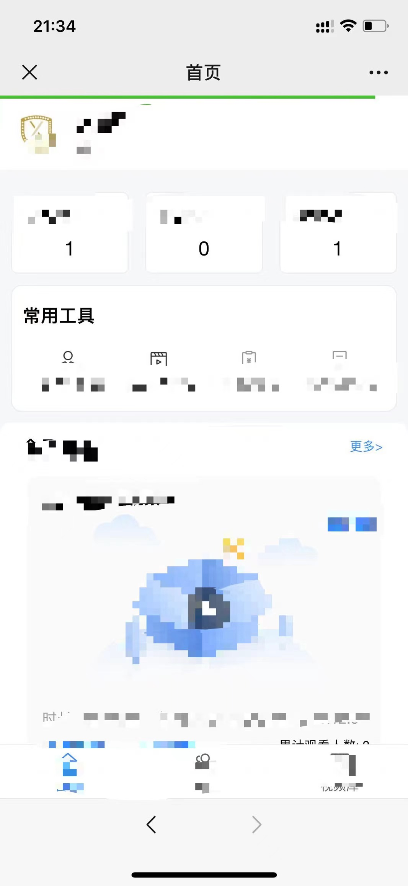
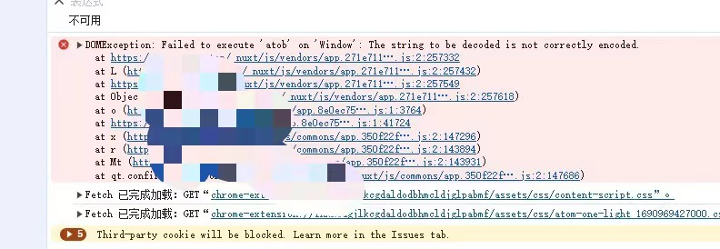

### 每次打开页面图片视频资源很耗流量，有没有办法解决？

#### 图片：

浏览器强缓存


#### 视频：

2.1 range请求头

Range: bytes=0-1024

如果服务器支持范围请求，它会以状态码206 Partial Content响应，并在消息体中包含指定范围的内容。

这种请求方式通常不支持强制缓存，因为Range请求的设计初衷是为了提高网络传输效率，允许客户端只加载视频的一部分，而不是整个视频文件。

2.2 完整文件请求

### 前端获取当前时间，不同时区时间不一样如何统一？
```
let moment = require('moment-timezone')
moment.tz(date, 'Asia/Shanghai').format('YYYY-MM-DD HH:mm:ss') // 统一为北京时间（东八区）
// 全局设置默认时区
moment.tz.setDefault('Asia/Shanghai')

// dayjs
const dayjs = require('dayjs')
const timezone = require('dayjs/plugin/timezone')
dayjs.extend(timezone)
dayjs.tz.setDefault('Asia/Shanghai')
// 单独设置
dayjs.tz("2025-01-15 14:25", "Asia/Shanghai")
```

### 后台通过aes加密，前端通过aes解密，加密过后的特殊字符含有“+”号的无法正确解密？

浏览器会把url中的+转为空格，导致解密失败。

解决办法：

1. 服务端把将“+”号转义为“%2B”，前端就可以把%2B解析为+了；

2. 使用base64编解码，不会出现+特殊字符。

### canvas 获取 video 视频第一帧做为封面图，偶现封面图加载不出来?
代码如下：
```
const videoEle = document.createElement('video')
videoEle.src = video
videoEle.crossOrigin = 'anonymous'
videoEle.currentTime = 1
videoEle.oncanplay = () => {
    const canvas = document.createElement('canvas')
    canvas.width = 80
    canvas.height = 80
    canvas.getContext('2d').drawImage(videoEle, 0, 0, canvas.width, canvas.height)
    const previewImgSrc = canvas.toDataURL('image/png')
    console.log(previewImgSrc) // 封面图
}
```
比较大的视频(时长30min左右)会偶现封面图加载不出来的情况。

把视频时间从1改成0.9，未复现以上问题：
```
videoEle.currentTime = 0.9
```

### 从CDN获取视频地址控制台有报错 net::ERR_FAILED 206 (Partial Content) ？


报错如图，但是视频可以播放。

```
const videoEle = document.createElement('video')
videoEle.src = videoUrl
// 会进入 error 事件
videoEle.onerror = (e) => {
    console.log('error', e)
}
```

可能的解决办法：修改 nginx 缓存大小。

### html页面滚动到顶部闪现大块空白，然后又正常渲染内容，是怎么回事？


有大图！ 头部logo就3M，换成200K的就好了。


### 微信浏览器 h5 如何判断是否已经网页授权？如何授权？

判断是否已经网页授权：可以把openid存cookie或缓存，已存在就是授权过直接跳目的页；

如何授权：直接跳转地址
```
jumpUrl = encodeURIComponent(location.protocol + '//' + location.hostname + jumpUrl)
let authUrl = `https://open.weixin.qq.com/connect/oauth2/authorize?appid=${appId}&redirect_uri=${jumpUrl}&response_type=code&scope=snsapi_userinfo&state=${state}&connect_redirect=1#wechat_redirect`
window.location.href = authUrl
```

微信网页授权文档：
https://developers.weixin.qq.com/doc/offiaccount/OA_Web_Apps/Wechat_webpage_authorization.html


### 微信浏览器 h5 如何直接关闭？

```
function wxJSBridgeClose() {
  if (typeof WeixinJSBridge === 'undefined') {
    document.addEventListener('WeixinJSBridgeReady', function onBridgeReady() {
      document.removeEventListener('WeixinJSBridgeReady', onBridgeReady, false)

      WeixinJSBridge.call('closeWindow')
    }, false)
  } else {
    WeixinJSBridge.call('closeWindow')
  }
}
```


### 微信浏览器 h5 页面回退或前进事件 如何监听？

ios:

location跳转触发popstate; vue router不触发;

< 回退按钮亮，跳到前一个页面触发popstate; > 前进按钮亮，跳到下一个页面触发popstate;

<> 跳转都不会触发vue路由(beforeEach...)

箭头不亮不触发 popstate。

没有路由栈如何触发 popstate:
```
this.pushHistoryFn() // 为了能触发 popstate
window.addEventListener('popstate', this.watchPopState, false)
window.removeEventListener('popstate', this.watchPopState, false)

pushHistoryFn() {
    pushHistory()
    function pushHistory() {
        const state = {
            title: 'title',
            url: '#'
        }
        window.history.pushState(state, 'title', '#')
    }
}
```

Android：只有左返回按钮，不触发popstate，但会触发vue路由(beforeEach...)


### 微信浏览器 h5 左上角X按钮关闭事件 如何监听？

监听不了


### 微信浏览器 h5 iOS偶现 头部绿色进度条一直loading怎么回事?

不知道啥原因，有一次抓包时遇到了：
```

captureError connect  http tunnel to gateway.icloud.com.cn:443
captureError connect http tunnel to xp.apple.com:443
```

这种情况wx.config未生效，分享好友设置无效。

手動刷新页面后是好的，不loading了。


### 微信h5分享 转发给朋友 卡片 如何配置？
```
wx.config({
    debug: false, // 开启调试模式,调用的所有api的返回值会在客户端alert出来，报错也会alert。
    appId: data.appId,
    timestamp: data.timestamp,
    nonceStr: data.nonceStr,
    signature: data.signature,
    jsApiList: ['updateAppMessageShareData', 'chooseWXPay'] // 必填，需要使用的JS接口列表
})

wx.ready(() => { // 需在用户可能点击分享按钮前就先调用
    wx.updateAppMessageShareData({
        title: this.currentObj.title, // 分享标题
        desc: '描述非必填',
        link: this.shareLink,
        imgUrl: this.currentObj.coverImage, // 必填
        success: function() {
            // 设置成功
            // alert('设置成功')
        },
        fail: function(error) {
            console.log('分享设置失败：' + error.errMsg)
        }
    })
})
```
如果使用url链接打开的页面，分享出去不是卡片，还是链接。

从公众号进去分享就是卡片。


### vue的beforeEach如何跳过某一个页面直接进入下一页？
```
// 跳微信授权页
goWxAuth() // 本来要进入的页面也在历史栈里，展示空白页面；授权页面回退会到空白页


next() // 会执行本来要进入的初始页面代码
goWxAuth() // 授权页面回退会到初始页面


next() // 最终只有home页面
location.href = '/home'


next() // 最终只有baidu页面
location.href = 'https://www.baidu.com'


next() // 放行，会向历史堆栈中添加一个新的记录
// android 只展示 /home 页面，页面底部< 返回直接closeWindow
// 在这里_blank ios没反应，还在初始页面无法打开/home
window.open('/home', '_blank') 


next({ // 直接替换初始页面进入到/home
    path: '/home',
    replace: true
})

```

### 如何记录视频播放进度，下次从观看位置继续播放？

监听页面回退，调接口记录视频播放时长；

但是有场景无法监听到页面回退或关闭，比如微信h5左上角关闭事件，那就在视频播放时使用定时器定时调接口；
```
this.player.on('play', (e) => {
    this.recordTimer = setInterval(() => {
        ...
    }, 15000)
})
```

### 承接上个问题，退出微信h5页面到后台，再次打开页面，定时器开启多个产生混乱
视频正在播放时退到后台，再次打开页面，会再次进入播放器play事件；又执行了定时器操作；

解决办法：监听页面隐藏，关闭定时器；
```
document.addEventListener('visibilitychange', () => {
    if (document.visibilityState === 'visible') {
        // alert('页面显示')
    } else if (document.visibilityState === 'hidden') {
        this.recordTimer && clearInterval(this.recordTimer)
    }
})
```

或者使用一个变量，判断开启过定时器，就return，不执行 this.player.on('play',...)里的代码。


### 微信网页授权 invalid signature


签名用到的url必须和当前页面的url地址一样

从公众号底部菜单跳转授权h5地址，如果state没有设置，ios第一次进入目的页面url上是state=，再刷新就是state，导致第一次进来就报错，刷新反而好了。android正常。

解决：state=111（随便写一个）

随便写的state=1，页面竟然报错了：

不知道啥原因，改了个state=111好了。

JS-SDK说明文档：

https://developers.weixin.qq.com/doc/offiaccount/OA_Web_Apps/JS-SDK.html


### 微信授权 使用code调接口获取用户信息，发现code使用了2次导致接口报错？


因为页面进行了301重定向，url后面加了个'/'，页面打开2次，code调接口执行2次，导致接口报错。

解决办法：要跳转的页面url后面直接加上/，就不会再重定向了。

### 微信授权 snsapi_userinfo 跳转后的页面返回的是虚拟用户？

微信官方：当开发者在网页中不规范使用发起 snsapi_userinfo 网页授权时，微信将默认打开网页快照页模式进行基础浏览。
此情况根据code获取到的用户信息openid等都是假用户，需要点击右下角 “使用完整服务” 触发授权弹窗，用户确认后进入原网页。

is_snapshotuser: 当用户是快照页模式虚拟账号时返回，值为1。

### vue2修改对象页面偶现不更新
原代码：
```
this.dataTotalObj = Object.assign(this.dataTotalObj, newData)
```
优化后：
```
this.dataTotalObj = { ...this.dataTotalObj, newData }
this.dataTotalObj = Object.assign({}, this.dataTotalObj, newData)
```
或者
```
this.$forceUpdate()
```

### 循环事件中使用 splice 的坑
```
for (let i = 0; i < arr.length; i++) {
    ...
    arr.splice(i, 1)
    i = i - 1 // 必须加这句
}
```
或 倒序删除
```
for(let i=arr.length-1;i>=0;i--) {
    ...
	arr.splice(i,1);
}
```

### vue修改query参数更新当前页面
```
let routeUrl = this.$router.resolve({
    name: 'NewPage',
    query: {
        id: this.id
    }
})
window.open(routeUrl.href, '_blank')
```
chrome浏览器新开一个页面，但没法回退了。

优化：
```
this.$router.push({
    name: 'NewPage',
    query: {
        id: this.id
    }
})

watch: {
    '$route.query': {
        handler(newVal) {
            this.resetAllData()
            this.initData()
        },
        immediate: true // 首次打开页面执行
    }
},
```

### 如何在用户离开页面时发送埋点？
现代浏览器引入了“往返缓存”（Back-Forward Cache, bfcache）。当用户导航到其他页面点击返回，浏览器可能会直接从缓存中恢复上一个页面，而不是重新加载。
```
window.addEventListener('pagehide', (event) => {
  if (event.persisted) {
    console.log('页面正在进入 bfcache')
  } else {
    console.log('页面正在被正常卸载')
  }

  // 埋点
  navigator.sendBeacon('/logs', data);
})
```

### 在子组件使用 van-popup 的 v-model="show" 报不能修改父组件传来的show属性问题

解决办法，定义一个新值：
```
<template>
  <van-popup
    v-model="isShow"
    position="bottom"
    safe-area-inset-bottom
    @click-overlay="clickCancel"
  >
    ...

data() {
    return {
      isShow: this.show
      ...

watch: {
    show(newVal, oldVal) {
        this.isShow = newVal
    }
}
```